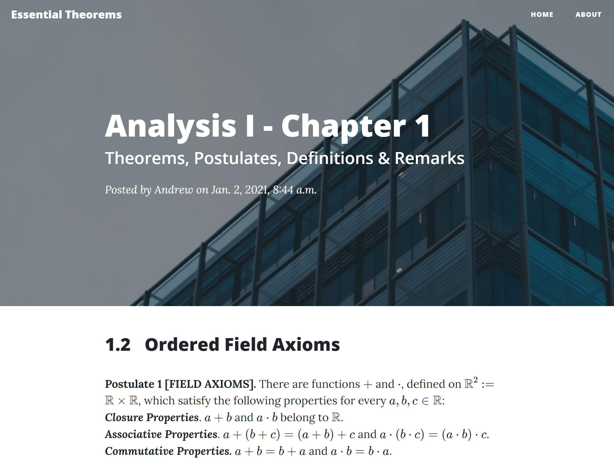

# Mathematics Blog

[Mathematics blog](http://abridglall.pythonanywhere.com/) for Georgetown math majors.

Built using three main tools:

1. [Django](https://www.djangoproject.com/) framework
2. [MathJax](https://www.mathjax.org/) JavaScript engine
3. [PythonAnywhere](https://www.pythonanywhere.com/user/abridglall/) for hosting

